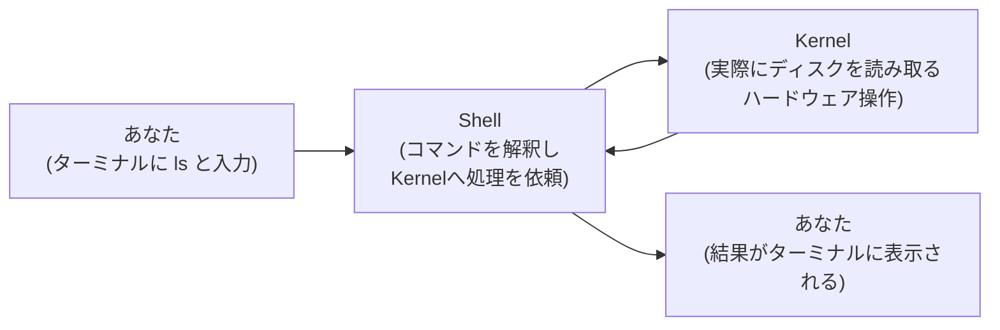
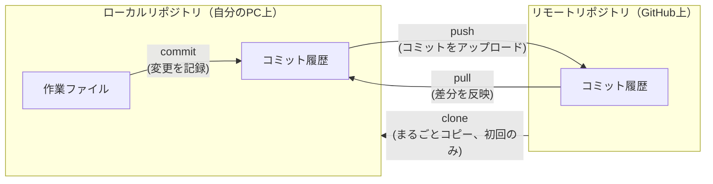
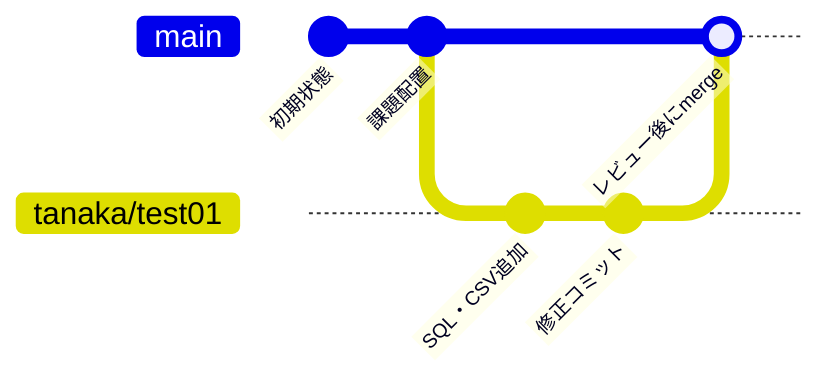
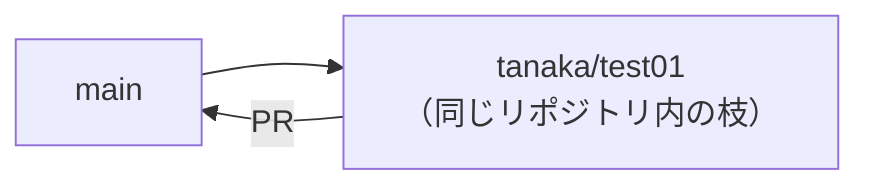
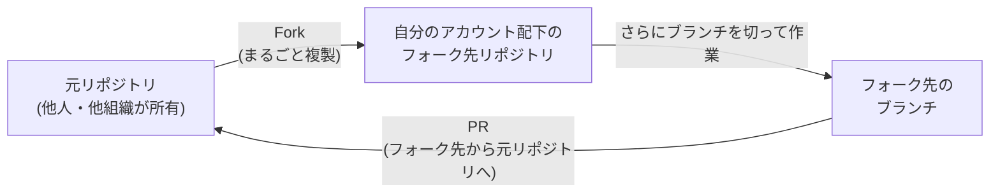
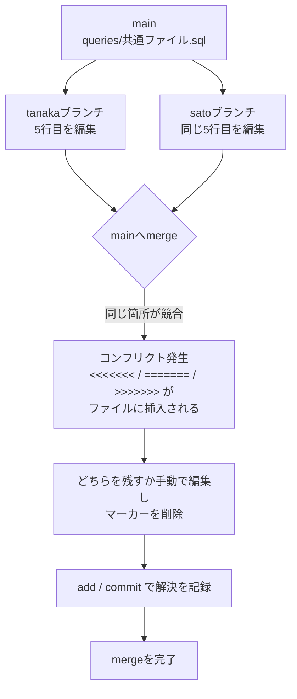
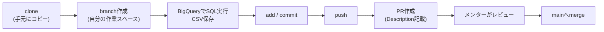

# データ抽出・集計 実践ミッション研修

対象：データ抽出・集計業務を行う初学者メンバー 3名

## このミッションのゴール

- Shellの基本操作（`cd` / `ls` / `grep`）に慣れる
- Gitの基本概念（clone / branch / add / commit / push）を体で覚える
- 「SQLクエリと結果CSVをセットにしてPRを出す」という実務の作法を身につける

座学は最小限にとどめ、実際のリポジトリとBigQuery環境を使った実践を中心に進めます。

## 参考リンク

- [【入門】Gitとは？できることや使い方、GitHubとの違いをわかりやすく解説（カゴヤのサーバー研究室）](https://www.kagoya.jp/howto/it-glossary/develop/git/)
  - Gitの基礎、用語、GitHubとの違いについてさらに詳しく知りたい場合はこちらも参照してください

---

## 研修の全体スケジュール

座学は **1時間 × 3回**。SQLテスト（課題の抽出作業）自体は座学の時間には含まれず、**各自のタイミングで個別に実施**します。**3回目の座学は、提出済みのSQLテストの答え合わせに使用**します。

| 回 | 時間 | 内容 | このタイミングで各自やること |
|---|---|---|---|
| 第1回 | 1時間 | 座学：Shell基礎 / Git基礎（clone）/ ミッション概要説明 | 座学後〜第2回までに：STEP1（clone・grepで課題確認）を各自実施 |
| 第2回 | 1時間 | 座学：Gitブランチの概念 / PRの概念（前半） | 座学後〜第3回までに：SQLテスト本体（STEP2、BigQuery環境が整い次第）＋ STEP3（ブランチ作成・commit・push・PR作成）を各自実施 |
| 第3回 | 1時間 | 座学：PRレビュー文化（後半）＋ 提出済みPRの答え合わせ・レビュー | - |

> 💡 メンターへの補足：第1回時点ではBigQuery環境が全員分整っていないことを想定し、SQLテスト本体（BigQueryでのSQL実行）は第1回では行わせないでください。第1回はSTEP1（clone・grep）までにとどめ、BigQuery環境の準備ができ次第、各自SQLテストに進んでもらう形にしています。また、第2回の座学で「ブランチ」を教えるタイミングでは、受講者はまだブランチを切っていない状態を想定しています。座学で概念を理解させたうえで、宿題としてSTEP3（ブランチ作成〜PR作成）に取り組ませてください。

---

# 第1回：Shell基礎・Git基礎（clone）とミッション開始

## 座学①：Shellとは / Gitとは（clone中心）

**Shellについて**

- ターミナル上でコンピュータに命令を出すための入力インターフェース
- 今回のミッションで直接使う中心コマンドは3つ：
  - `cd`：ディレクトリ（フォルダ）を移動する
  - `ls`：今いる場所のファイル・フォルダ一覧を見る
  - `grep`：ファイルの中から特定の文字列を検索する
- これらは「今どこにいて、何があるか」を確認するための道具。データエンジニアリング業務では、サーバー上のログ確認やファイル探索で日常的に使う

**ShellとKernel（カーネル）の関係**

「Shellって結局何をしているの？」を理解するために、コンピュータの内部構造を少しだけ覗いてみましょう。

- **Kernel（カーネル）**：OS（オペレーティングシステム）の中核部分。CPU・メモリ・ディスク・ネットワークなどのハードウェアを直接管理しており、ファイルの読み書きやプログラムの実行など、コンピュータ上の実際の処理は最終的にすべてKernelが行っています
- ただし、Kernelは機械に近い低レベルな命令しか受け付けないため、人間が`ls`のような言葉で直接話しかけることはできません
- **Shell**：人間が入力した`ls`や`cd`のようなコマンドを受け取り、Kernelが理解できる形に変換して処理を依頼し、返ってきた結果を人間に分かりやすい形で画面に表示する「通訳」のような役割のプログラムです

例えるなら、Kernelは車を実際に動かす「エンジン」、Shellはそのエンジンを人間が操作するための「ハンドル」のような関係です。エンジンは動力を生み出す本体ですが、それ自体を直接手でコントロールすることはできません。ハンドルを通して「右に曲がりたい」という人間の意思をエンジンや駆動系に伝えることで、車は思い通りに動きます。同じように、Kernelは処理を実行する本体であり、Shellを通して人間の指示（コマンド）をKernelに伝えることで、コンピュータは思い通りに動きます。ターミナルに`ls`と入力してから結果が表示されるまで、内部では次のようなやり取りが行われています。



用語を整理すると、以下のような役割分担になっています。

| 用語 | 役割 |
|---|---|
| Kernel | OSの中核。ハードウェア（CPU/メモリ/ディスク等）を直接管理し、実際の処理を実行する |
| Shell | 人間が入力したコマンドを解釈し、Kernelに処理を依頼する「通訳」役のプログラム |
| ターミナル | Shellとやり取りするための「窓口」となる画面（アプリ） |

> 💡 補足：普段使っている「ターミナル」「コンソール」「コマンドプロンプト」は、いずれも“Shellを操作するための画面（アプリ）”を指す言葉であり、Shellそのものではありません。今回の研修でみなさんが使うのは、Windowsであれば`Git Bash`（内部的には`bash`というShellを使用）、Macであれば標準の`zsh`などです。同じ「コマンドを入力する」という体験でも、画面（ターミナル）と、実際にコマンドを解釈するプログラム（Shell）は別物である、という点を覚えておいてください。

**あわせて知っておくと便利なコマンド**

作業中に自然と使うことになるので、ここで一緒に覚えておきましょう。

| コマンド | 用途 | 使用例 |
|---|---|---|
| `pwd` | 今自分がどのディレクトリにいるかを表示する。`cd`で移動した後、迷ったらまずこれ | `pwd` |
| `cat` | ファイルの中身を全部表示する | `cat tasks/test_01.md` |
| `less` | 長いファイルをスクロールしながら読む（`q`で終了） | `less tasks/test_01.md` |
| `head` | ファイルの先頭数行だけ表示する。大きいCSVの中身を確認する時に便利 | `head results/tanaka.csv` |
| `tail` | ファイルの末尾数行だけ表示する | `tail results/tanaka.csv` |
| `wc -l` | ファイルの行数を数える。CSVの件数確認＝検算の基本ツール | `wc -l results/tanaka.csv` |
| `mkdir` | 新しいディレクトリを作成する | `mkdir memo` |
| `cp` | ファイルをコピーする | `cp a.csv a_backup.csv` |
| `mv` | ファイルを移動・リネームする | `mv a.csv results/` |
| `rm` | ファイルを削除する（**取り消せないので要注意**、迷ったらメンターに確認） | `rm unused.txt` |
| `history` | 過去に実行したコマンドの履歴を表示する | `history` |
| `man` / `--help` | コマンドの使い方（マニュアル）を調べる | `man grep` / `grep --help` |

> 💡 特に `wc -l` は、後ほどSTEP2の検算（全ユーザー数とCSVの行数が合っているか等）で実際に使うので、ここで使い方を覚えておきましょう。

**Gitについて（なぜ生まれたか）**

- 複数人で同じファイルを編集する現場では、「どれが最新版か分からなくなる」「誰かが上書きして前の変更が消える」といった事故が起きがち
- 従来はファイル名に日付やバージョン番号を付けて手作業で管理することが多かったが、この方法はファイルが増えるほど破綻しやすい
- Gitのようなバージョン管理システムは、「いつ・誰が・どのように変更したか」という履歴を自動的に記録することで、この問題を解決するために生まれた
- 履歴が残っているため、誤って上書きしてしまっても、任意の過去の状態に戻すことができる

**Gitの基本用語（今日はここまで理解すればOK）**

| 用語 | 意味 |
|---|---|
| リポジトリ | ファイルと変更履歴を保存しておく場所。自分のPC上にある「ローカルリポジトリ」と、GitHub上にある「リモートリポジトリ」の2種類がある |
| コミット | 変更内容をリポジトリに記録として登録すること |
| クローン (clone) | リモートリポジトリの中身を、ローカルリポジトリへまるごとコピーすること |
| プッシュ (push) | ローカルリポジトリのコミットを、リモートリポジトリへアップロードすること |
| プル (pull) | リモートリポジトリの変更を、ローカルリポジトリへ反映させること |

> 💡 clone と pull の違い：cloneは「まだ何もない状態にまるごとコピーする」時に使い、pullは「既に手元にあるリポジトリを最新の差分だけ更新する」時に使います。今日は初回なのでcloneを使います。

図にすると、ローカルリポジトリとリモートリポジトリの間を、これらの用語がどう行き来しているかが分かります。



- **リポジトリ**：図の2つの箱（ローカルリポジトリ／リモートリポジトリ）そのもの
- **コミット**：ローカルリポジトリの中で「作業ファイル」から「コミット履歴」へ変更を記録する矢印
- **クローン**：まだ何もない状態のときに、リモートの中身をローカルへまるごとコピーする矢印（今日はこれを使う）
- **プッシュ**：ローカルのコミットをリモートへアップロードする矢印
- **プル**：リモートの変更をローカルへ反映する矢印

**GitとGitHubの違い**

- Git：バージョン管理の「仕組み」そのもの。誰のPCにもインストールして単体で使える
- GitHub：そのGitの仕組みを、インターネット上でチーム利用できるようにしたサービス。今回はGitHub上のリポジトリを「リモートリポジトリ」として使う
- `git clone` は「リモート（GitHub）にあるリポジトリを、自分の手元にまるごとコピーする」操作
- 今の時点ではまだ「ブランチ」の話はしない。まずは「手元にリポジトリを持ってくる」ことだけを理解すればOK

## 実践：STEP 1（Shell基礎と課題の発見）

**やること：リポジトリを手元に持ってきて、課題の中身を確認する**

0. （初回のみ）Gitにまだ自分のユーザー名・メールアドレスを登録していない場合は、先に設定します。コミットした際に「誰の変更か」を記録するために必要です。
git config --global user.name "自分の名前"
git config --global user.email "自分のメールアドレス"
git config --list    # 正しく登録されたか確認

1. ターミナルを開き、作業用ディレクトリに移動します。
cd ~/workspace   # 自分の作業ディレクトリに合わせて変更

2. リポジトリをクローンします。
git clone <共有されたリポジトリURL>

3. クローンしたディレクトリに移動し、中身を確認します。
cd data-training-mission
ls
ls tasks/

4. `tasks/` の中にある課題ファイルの中身を、`grep` を使って確認します。
   まずは「要件」というキーワードで検索し、何を求められているか把握しましょう。
grep "要件" tasks/test_01.md

   > 💡 ヒント：`grep` は「ファイルの中から特定の文字列を含む行を探す」コマンドです。
   > `-n` オプションをつけると行番号も表示されます。全文を読みたい場合は `cat tasks/test_01.md` を使いましょう。

5. 課題ファイル（`tasks/test_01.md`）を最後まで読み、以下を自分の言葉でメモしてください。
   - 何を集計する課題か
   - 提出物として何が求められているか
   - 検算（答え合わせ）の観点は何か

**✅ STEP 1 完了条件：課題内容を自分の言葉で説明できる状態になっていること**

---

# 第2回：Gitブランチの概念・PRの概念（前半）

## 座学②：ブランチとは何か

**なぜブランチが必要か**

- もし全員が同じ`main`ブランチに直接コミットすると、他の人の作業を上書きしてしまう・意図しない変更が紛れ込む、といった事故が起きやすい
- そこで、それぞれの作業者が「自分専用の作業スペース（ブランチ）」を作り、そこで作業を完結させてから`main`に合流（マージ）する、という流れを取る
- イメージ：`main`という1本の太い幹から、自分専用の枝（ブランチ）を生やして作業し、完成したら幹に合流させる

以下は今回の研修の流れをイメージ図にしたものです（GitHub上でこのファイルを開くと図として表示されます）。



**ブランチ・マージの用語整理**

| 用語 | 意味 |
|---|---|
| ブランチ | 同じリポジトリの中で変更履歴を分岐させること、またはその分岐そのもの。ブランチ上で変更しても`main`には影響しない |
| マージ | 作成したブランチの変更内容を、`main`ブランチへ統合すること。マージによって初めて、自分の変更が本流に反映される |

- 今回の研修では、マージ（PRのマージ）はメンターがレビュー後に行います。受講者自身が行うのは「ブランチ作成」「commit」「push」「PR作成」までです
- 実務では、ブランチは「バグ修正用」「機能追加用」など、目的ごとに作られることが一般的です

**コラム：Forkとの違い**

似た概念に「Fork（フォーク）」があります。混同しやすいので整理しておきます。

| 項目 | ブランチ | フォーク |
|---|---|---|
| 何をコピーするか | 同じリポジトリの中で履歴を分岐させる | リポジトリそのものを、自分のGitHubアカウント配下にまるごと複製する |
| 主に使う場面 | 同じチーム・同じリポジトリへの書き込み権限がある場合 | 書き込み権限のない他人・他組織のリポジトリに変更を提案したい場合（OSS＝オープンソースプロジェクトへの貢献など） |
| PRの出し先 | 同じリポジトリ内の`main`へPR | フォーク元の元リポジトリへPR（＝Fork先からのPRという扱いになる） |

図で比べると、「どこにコピーが作られるか」の違いがポイントです。

**ブランチ（同じリポジトリの中）**



**フォーク（別アカウントへの複製）**



- ブランチは「同じ家の中の別部屋」、フォークは「隣に自分の家をまるごと建てる」イメージです。ブランチは元のリポジトリの中に留まりますが、フォークは自分のGitHubアカウント配下に独立したコピーが作られ、その中でさらにブランチを切って作業します

**Forkの使い所の例**

- 会社に書き込み権限のない、社外のOSSリポジトリ（例：使っているライブラリ本体）にタイポ修正やバグ修正を提案したいとき
- 個人的に技術検証（PoC）をしたいが、元のリポジトリを汚したくない・影響を与えたくないとき
- 同じ組織内でも、「まずは提案ベースで見せたい」「相手の承認前に自分の手元で自由に大きく変更したい」など、書き込み権限を求めるほどではない・意図的に距離を置きたい場面

- 今回は3名とも同じリポジトリへの書き込み権限を持っているため、**Forkは使わずブランチのみで進めます**
- もし今後、外部のOSSリポジトリに変更を提案する機会があれば、その時は「Fork → 自分のFork先でブランチ作成 → 元リポジトリへPR」という流れになる、と覚えておくとよいでしょう

**コラム：コンフリクト（衝突）とは**

複数人がブランチで作業していると、「同じファイルの同じ箇所」を別々に編集してしまうことがあります。この状態で`main`へマージしようとすると、Gitはどちらの変更を採用すべきか自動で判断できず、**コンフリクト（衝突）**として作業者に判断を委ねます。



- コンフリクトはエラーではなく、「Gitが判断を委ねてきているだけ」の状態。慌てず、該当ファイルを開いて`<<<<<<<`〜`>>>>>>>`の間を見比べ、どちらを残す（または両方活かす）か手動で決めて保存すればOK
- 今回の研修では、各自 `queries/<自分の名前>.sql` / `results/<自分の名前>.csv` とファイル名を分けているため、基本的にコンフリクトは起きない設計にしています。ただし実務では同じファイルを複数人が触ることは頻繁にあるため、概念として知っておきましょう

**今回使うコマンド**

- `git branch`：今あるブランチの一覧を見る（自分が今どのブランチにいるかも分かる）
- `git checkout -b <ブランチ名>`：新しいブランチを作成し、同時にそのブランチに切り替える
- `git status`：今の変更状況・今いるブランチを確認する（迷ったらまずこれ）

**ブランチ名のルール（今回）**

`<自分の名前>/test01` の形式を使います（例：`tanaka/test01`）。実務でも「誰が」「何のために」作ったブランチかが分かる命名が推奨されます。

## 座学③：PRとは何か（前半・概念編）

- PR（Pull Request）とは、「自分のブランチの変更を、`main`ブランチに取り込んでほしい」という**依頼**のこと
- ただの「マージボタン」ではなく、**マージする前に他の人がレビューできる場**という点が重要
- なぜレビューが必要か：
  - 本人が気づいていないミスや考慮漏れを、第三者の目でチェックできる
  - 「なぜこう書いたか」を言語化することで、自分自身の理解も整理される
  - チーム全体の知識共有（他の人がどう書いたかを見て学べる）にもなる
- PRの単位は「1つの完結した作業」。今回は「課題01のSQLとCSV一式」がその単位になる

今回のミッション全体の作業フローを図にすると、以下のようになります。



（PRレビュー文化の詳細な作法は、第3回の座学で扱います）

## 実践：SQLテスト本体（データ抽出）

> 💡 第1回時点ではBigQuery環境が全員分整っていないため、このSTEPは第1回では行いません。自分のBigQuery環境（GCPアクセス権・データセット）が使えることを確認できてから着手してください。

第2回の座学が終わったら、次回（第3回）までの間に、各自のBigQuery環境が整い次第、以下を進めてください。

### BigQueryでSQLを実行する

BigQueryコンソール（またはbqコマンド）で、課題の要件を満たすSQLを作成・実行します。

- 使用するデータセット・テーブル名は課題ファイル（`tasks/test_01.md`）に記載されています
- まずは小さく試して（例：`SELECT * FROM ... LIMIT 10`）テーブルの中身を把握してから、本題のクエリを組み立てましょう
- 集計には `GROUP BY`、件数には `COUNT(DISTINCT ...)`、並び替えには `ORDER BY` が使えそうです（具体的な組み合わせは自分で考えてみてください）
- SQLを書く際は、[`docs/sql_coding_rules.md`](./sql_coding_rules.md) のSQLコーディングルールを参照してください。🔴 Must（必須）は必ず守り、🟡 Want（推奨）もできる限り適用しましょう

### クエリとCSVをローカルに保存する（この時点ではまだgit操作はしません）

**ルール：**

| 種類 | 保存先 | ファイル名の例 |
|---|---|---|
| 実行したSQL | `queries/` | `queries/tanaka.sql` |
| 実行結果CSV | `results/` | `results/tanaka.csv` |

BigQueryコンソールの「結果をダウンロード」→「CSVでローカルに保存」を使うか、`bq query` の結果をCSVにリダイレクトする方法でも構いません。
ls queries/ results/    # 保存できているかここで必ず確認する

> 💡 検算のヒント：`wc -l results/<自分の名前>.csv` でCSVの行数を数え、想定される都道府県数（＋ヘッダー行1行分）と一致しているかも確認してみましょう。件数のズレに気づく良い手がかりになります。

**✅ SQLテスト完了条件：`queries/<名前>.sql` と `results/<名前>.csv` が手元に存在すること（この時点ではまだpushしなくてOK）**

---

## 実践：STEP 2（ブランチ作成）〜 STEP 3（コミット・push・PR作成）

第2回の座学が終わったら、次回（第3回）までの間に、以下を進めてください。SQLとCSVはすでに手元にある前提です。

### 2-1. ブランチを作成する
git branch                     # 現在のブランチを確認
git checkout -b <自分の名前>/test01   # 例: git checkout -b tanaka/test01

### 2-2. 変更をステージング・コミットする
git status                      # 何が変更されたか確認する癖をつける
git add queries/<自分の名前>.sql results/<自分の名前>.csv
git commit -m "課題01: 都道府県別ユーザー・売上集計を提出"

> 💡 ヒント：`git add` は「コミットする対象を選ぶ」作業、`git commit` は「選んだものを記録として確定する」作業です。

### 2-3. リモートにpushする
git push origin <自分の名前>/test01

初回pushの場合、`git push` だけだとエラーになることがあります。その場合は上流ブランチの設定が必要な旨がターミナルに表示されるので、指示されたコマンドを確認して実行してください。

### 2-4. GitHub上でPull Requestを作成する

1. GitHubのリポジトリページにアクセスすると、「Compare & pull request」のボタンが表示されるはずです（表示されない場合は「Pull requests」タブ→「New pull request」）
2. base（マージ先）が `main`、compare（自分の変更）が `<自分の名前>/test01` になっていることを確認
3. PRのタイトルを設定（例：`課題01: 都道府県別ユーザー・売上集計`）
4. Description欄には、STEP 3-4（次項）の必須項目をこの時点で記載しておいてください

**✅ 第2回終了までの完了条件：PRがGitHub上に作成されていること（Descriptionの中身は第3回座学の内容を踏まえて仕上げてもOK）**

---

# 第3回：PRレビュー文化（後半）＋ 答え合わせ

## 座学④：PRレビュー文化（実務の作法）

PRのDescription（説明欄）には、**必ず以下の3項目**を記載するのが今回のチームのルールです。これは今後、実務でPRを出す際にも通用する必須マナーです。

```markdown
## 工夫した点
（例：0件の都道府県も表示させるためにJOINの種類を工夫した、など）

## 悩んだ点
（例：COUNT(DISTINCT ...)が必要な理由に気づくまで時間がかかった、など）

## 検算（テスト）した内容
（例：全ユーザー数の合計と、都道府県別ユーザー数の合計を突き合わせて一致を確認した、など）
```

**なぜこれが大事か**

- レビュアーは「結果が合っているか」だけでなく「どう考えてそこに至ったか」を見ている
- 「悩んだ点」を正直に書くことは恥ずかしいことではなく、レビューの質を上げるための情報提供
- 検算内容を書くことで、レビュアーは同じ検算を繰り返さずに信頼して見ることができる（レビューコストの削減）
- これらが書かれていないPRは、実務では「差し戻し」の対象になりやすい、ということも伝えておく

## 実践：答え合わせ（3名分のPRレビュー）

第3回では、3名それぞれのPRを画面共有しながら、以下の観点でメンターと一緒に確認します。

1. **正しさ**：課題の要件（都道府県別ユーザー数・売上合計・0件除外なし・降順）を満たしているか
2. **検算**：Description記載の検算方法が妥当か、実際に合計が一致しているか
3. **SQLの書き方**：可読性、JOINの種類の選択、集計関数の使い方について講評
4. **Descriptionの質**：工夫した点・悩んだ点が具体的に書けているか

3名分を順番に見ていくため、他の受講者のSQLやハマりどころも共有知として学べます。

**✅ 研修全体の完了条件：3名全員のPRがレビューされ、コメントを踏まえて必要な修正がある場合は追記コミットされていること**

---

## 困ったときは

| 症状 | まず試すこと |
|---|---|
| `git clone` できない | URLが正しいか、アクセス権があるかを確認 |
| ブランチを間違えた | `git branch` で現在地を確認し、`git checkout <正しいブランチ名>` |
| `git push` が拒否される | エラーメッセージ内のコマンド候補（`git push --set-upstream ...` など）を確認 |
| コミットしすぎて戻したい | 自己判断でリセットせず、メンターに現状を共有してから対応 |

**このミッションで一番大事なこと：分からなくなったら、まず `git status` で現在地を確認する癖をつけることです。**
